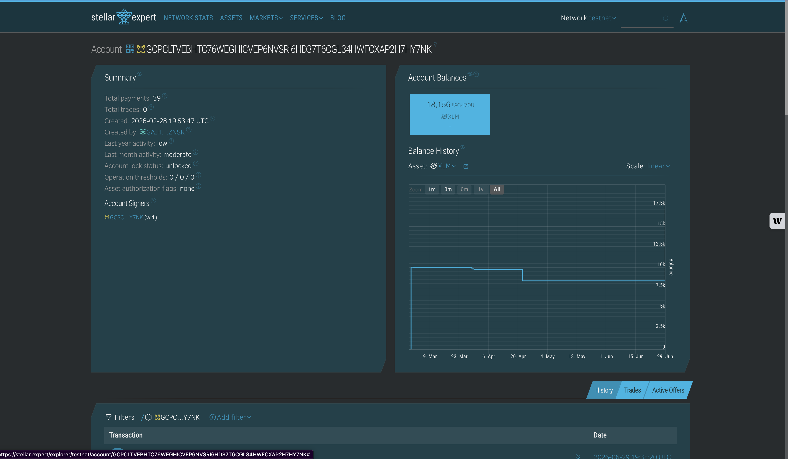

# Stellar Testnet Faucet

A simple Level 1 White Belt dApp for connecting Freighter and requesting Stellar
testnet XLM in one click.

The interface is intentionally small: connect, request XLM, confirm the result.

## Features

- Connect and disconnect a Freighter wallet.
- Restore an already approved Freighter wallet session.
- Request testnet XLM from Stellar Friendbot.
- Fetch and display the connected wallet's native XLM balance.
- Show clear success and error states with inline status and toast notifications.
- Link to the funded account or Friendbot transaction on Stellar Expert.

## Tech Stack

- React + Vite + TypeScript
- Freighter API
- Horizon testnet
- Stellar Friendbot

## Local Setup

Install dependencies:

```bash
npm install
```

Run the development server:

```bash
npm run dev
```

Build for production:

```bash
npm run build
```

## How To Test

1. Install the Freighter browser extension.
2. Switch Freighter to `Testnet`.
3. Open the local app from the Vite dev server.
4. Click `Connect Freighter`.
5. Click `Request testnet XLM`.
6. Confirm the success state, transaction hash link, and updated XLM balance.

## Screenshots

Add the final challenge screenshots here after testing with Freighter:

### Wallet connected state


### Balance displayed


### Successful testnet transaction



The successful transaction screenshot should show the `XLM received` status and
the Stellar Expert transaction hash link displayed by the app.

## Submission Checklist

- Public GitHub repository.
- Project description in this README.
- Local setup instructions in this README.
- Wallet connected screenshot.
- Balance displayed screenshot.
- Successful testnet transaction screenshot.
- Transaction result shown in the UI.

## Project Structure

```text
.
├── docs
│   └── screenshots
├── src
│   ├── App.tsx
│   ├── main.tsx
│   └── styles.css
├── index.html
├── package.json
├── tsconfig.json
├── vite.config.ts
└── README.md
```

This is a UI-only Stellar dApp for the Level 1 challenge. No Soroban contract is
required for this submission.
